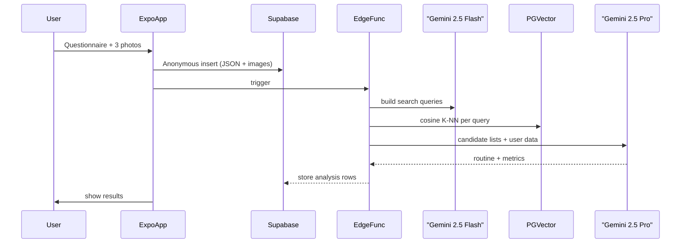

# Skinsight – Expo Go Demo

> **TL;DR** — Cross‑platform skincare coaching powered by Expo Go, Supabase, and a dual‑LLM semantic search pipeline. Rapidly prototyped with **Cline** (Gemini 2.5 Pro boilerplate), **Vercel v0** UI generators, and Figma.

---

## Table of Contents
1. [Project Overview](#project-overview)
2. [User Flow](#user-flow)
3. [Feature Matrix](#feature-matrix)
4. [Tech Stack](#tech-stack)
5. [AI & Data Pipeline](#ai--data-pipeline)
6. [Folder Structure](#folder-structure)
7. [Quick Start](#quick-start)
8. [Environment Variables](#environment-variables)
9. [Local Development](#local-development)
10. [Deployment](#deployment)
11. [Roadmap](#roadmap)
12. [Contributing](#contributing)
13. [License](#license)

---

## Project Overview
Skinsight is a mobile app that crafts personalized AM / PM skincare routines by combining a brief questionnaire, a three‑angle face scan, and live product data. The MVP was built in **36 hours** for UnitedHacks v5 2025 using Expo Go and bootstrapped with **Cline (Gemini‑2.5‑Pro)** for boilerplate and iterative scaffolding.

Key goals:
- <strong>Zero‑friction onboarding</strong> — ≤ 90 seconds from install to routine.
- <strong>LLM‑grade decisions</strong> — Gemini 2.5 Flash + Pro choose products & scores.
- <strong>Data‑portable</strong> — Anonymous→Authenticated migration w/ Supabase RLS.


## User Flow
1. **Welcome ▶ Questionnaire** – 10ish low‑friction questions → cached anonymously in Supabase.
2. **Face Scan** – 3 photos stored in a secured, RLS‑protected bucket.
3. **Edge Function** – Triggers dual‑LLM pipeline + K‑NN search.
4. **Analysis Pages** – Hydration, Barrier, Redness + routine recommendations.
5. **Auth Upgrade** – OAuth / email link → anonymous rows migrated to `profiles`.
6. **Dashboard & Routine** (post‑MVP) – Adherence tracking, environmental tips.


## Feature Matrix
| Module | Stack | Status |
|--------|-------|--------|
| Questionnaire | React Native + Expo Router | ✅ MVP |
| Face Scan | Expo Camera SDK | ✅ MVP |
| Vector Search | PGVector (cosine) | ✅ MVP |
| Edge Functions | Supabase Functions (Deno) | ✅ MVP |
| Dual LLM | Gemini 2.5 Flash → Pro | ✅ MVP |
| Auth & Storage | Supabase Auth + RLS Buckets | ✅ MVP |
| Home / Routine | React Query + Zustand | ⏳ Q2 |
| Apple Health Sync | HealthKit Bridge | ⏳ Q3 |


## Tech Stack
| Layer | Tooling |
|-------|---------|
| **Mobile** | Expo Go · React Native 0.74 · TypeScript 5 |
| **Boilerplate** | **Cline** (Gemini 2.5 Pro powered CLI) |
| **UI** | **Vercel v0** component gen · Figma Tokens · Tailwind RN |
| **Backend** | Supabase (Postgres 15, PGVector 0.6, Storage, Auth, Edge Functions) |
| **AI** | Gemini 2.5 Flash (query synth) · Gemini 2.5 Pro (reasoning) |
| **Infra** | Supabase Cloud · expo eas build


## AI & Data Pipeline


### Asymmetric Embeddings
- **Document encoder** (products) → 768‑dim vectors via `gemini‑embedding‑001`.
- **Query encoder** (user intent) → 512‑dim vectors for tighter recall.
- Cosine similarity drives sub‑10 ms search (~780 products, 20 probe).


## Folder Structure
```
apps/
└── mobile/              # Expo project root
    ├── app/             # Expo Router screens
    ├── components/      # Vercel v0 generated UI
    ├── lib/             # API hooks, Supabase client
    └── store/           # Zustand global state
supabase/
└── functions/           # Edge Functions (TypeScript / Deno)
        embed-query.ts
        migrate-user.ts
``` 


## Quick Start
```bash
# 1. Clone & install
pnpm i

# 2. Copy env vars
cp .env.example .env

# 3. Run Supabase locally (optional)
supabase start

# 4. Launch Expo
pnpm dev
```
Open the QR code in **Expo Go** and you’re rolling.


## Environment Variables
| Key | Description |
|-----|-------------|
| `SUPABASE_URL` | Project URL |
| `SUPABASE_ANON_KEY` | Public anon key |
| `GEMINI_API_KEY` | Google AI Studio key |
| `IMAGE_BUCKET` | Supabase storage bucket |
| `EMBED_MODEL` | `gemini-embedding-001` |


## Local Development
- **Hot Reload** – Expo Go or iOS Simulator.
- **Edge Functions** – `supabase functions serve edge_func_name`.
- **DB Migrations** – `supabase db push` (SQLX).


## Deployment
| Target | Command |
|--------|---------|
| **iOS / Android** | `eas build --profile preview` |
| **Edge Functions** | `supabase functions deploy` |
| **Landing Site** | `vercel --prod` |


## Roadmap
| Quarter | Milestone |
|---------|-----------|
| **Q1** | v1.1 **DeepScan** – subsurface analysis, marketing site, influencer push |
| **Q2** | v2.0 **Skinsight** – $9.99 tier, Android, KR/ES locales, K‑beauty store, 250k images |
| **Q3** | v3.0 **Lifestyle Loop** – Apple Watch sync, FDA 510(k) groundwork, B2B API |
